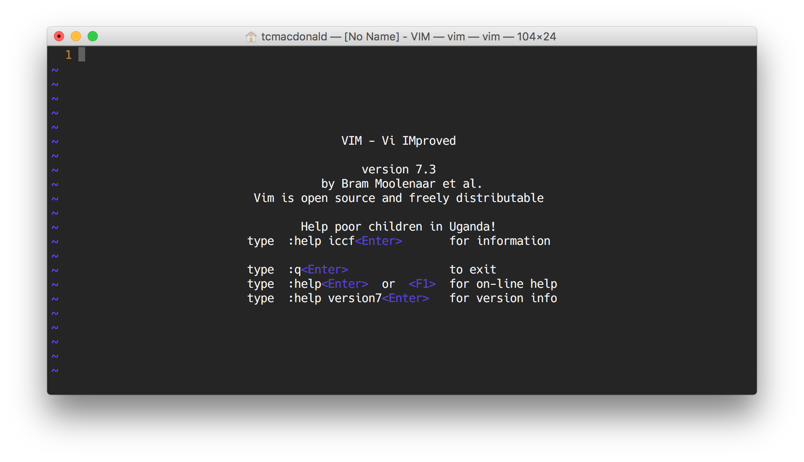

## A Brief History Lesson

> A Unix "shell" is a command-line interpreter that provides a traditional user interface for the Unix operating system and for Unix-like systems.

* There are a [bunch of different shells](http://www.ibm.com/developerworks/library/l-linux-shells/figure1.gif)... Bourne shell, C shell, Korn shell, Z shell, etc.
* The first major shell was the Bourne Shell, developed in the late 70's.
* We're going to focus on the "Bourne again shell" or _Bash_ (default shell for OSX and Linux)

_Hint: You can install Bash bindings in Windows via [Git for Windows](https://git-for-windows.github.io/)_

## Why Bash?

* A fully-capable scripting language
* Vast adoption (approximately [70% of public servers](https://en.wikipedia.org/wiki/Usage_share_of_operating_systems#Public_servers_on_the_Internet) are Unix or Unix-like)
* Tons of command line features...
    * Tab completion
    * Pipes
    * Aliases
    * Environment variables
    * Startup scripts
    * ...and more!

## Essential Commands

In this next part, we'll learn some basic commands that we can use to interact with our Bash shell.

The outline below is provided as a handy reference of the commands we'll cover in class. [This tutorial](http://programminghistorian.org/lessons/intro-to-bash) contains alot of additional information if you're confused or just curious.
&nbsp;  

---

`pwd` - Display your _"present working directory"_.

---

`ls` - Display the contents of a directory specified by `<path>`.
> __Optional Flags:__  
> Long listing (with details)... `ls -l`  
> List all files... `ls -a`

> __Optional Arguments:__  
> Apply to files or directories... `ls <path>`

> __Hint:__  
> You can use the wildcard character too... `ls *.txt`

---

`man` - Display documentation for a given command. _"Man" is short for "manual"._

> __Required Arguments:__  
> The command to display documentation for... `man <command>`

> __Hints:__  
> Exit a man page by pressing the 'q' key on your keyboard.

---

`cd` - Change to directory specified by `<path>`

> __Optional Arguments:__  
> The location to move to... `cd <path>`

> __Special Characters:__  
> Move to the parent directory... `cd ..`  
> Return to previous working directory... `cd -`  
> Root of filesystem... `cd /`  
> Your home directory... `cd ~` or `cd --`  

---

`open` - View directory or file specified by `<path>`.

> __Required Arguments:__  
> Directory or file... `open <path>`

> __Special Characters:__  
> A dot character refers to the current directory... `open .`

> __Note For Windows Users...__  
> Use this command instead... `explorer .`

---

`mkdir` - Make a new directory.  

> __Required Arguments:__  
> The name of the new directory... `mkdir <name>`

> __Optional Flags:__  
> Create intermediate directories as required. ... `mkdir -p <path>`  

---

`wget` - Download a file.

> __Required Arguments:__  
> File url... `wget <url>`

> __Hint:__  
> Try executing this... `wget http://www.gutenberg.org/files/2600/2600-0.txt`

> __Note for Mac Users:__  
> If you don't have `wget` try this... `curl -O  http://www.gutenberg.org/files/2600/2600-0.txt`

---

`cat` - Concatenate and print files

> __Required Arguments:__  
> The file to concatenate... `cat <file>`

> __Hint:__  
> Path multiple paths to concatenate files... `cat <file> <file>`

> __Special Characters:__  
> Send output to a new file... `cat file1.txt file2.txt > combined.txt`  
> Wildcards... `cat *.txt > all-the-files.txt`

---

`head` - Show the first ten lines of a file.

> __Required Arguments:__  
> The file to display... `head <file>`

> __Optional Flags:__  
> Specify `n` lines... head -n 25 <file>`

---

`tail` - Show the last ten lines of a file.

> __Required Arguments:__  
> The file to display... `tail <file>`

> __Optional Flags:__  
> Specify `n` lines... tail -n 25 <file>`

---

`mv` - Move (or rename) a file or directory  

> __Required Arguments:__  
> The target and destination... `mv <target> <destination>`

---

`cp` - Copy a file or directory  

> __Required Arguments:__  
> The target and destination... `cp <target> <destination>`

> __Optional flags:__  
> Copy recursively (directories)... `cp -R`  

---

`rm` - Remove files and directories  

> __Required Arguments:__  
> The file or directory to remove... `rm <path>`

> __Optional Flags:__  
> Remove recursively (directories)... `rm -r`  

---

`history` - Show command history  
> __Special Characters:__  
> Recall previous command... `!!`  
> Repeat command in your history... `!<linenumber>`  

---

`vim` - Create and edit text files.
> __Optional Arguments:__  
> The directory or file(s) you want edit... `vim <path>`

---

## Editing Text Files with Vim

Vim (which stands for Vi-improved) is a heavy-duty text-editor alot of developers use full-time.

It is, admittedly, confusing as hell for new users because it relies solely on keyboard shortcuts to navigate the interface. But it's installed almost everywhere (and is generally the default editor on most Unix-esque systems) so its worth being familiar with.
&nbsp;  

### Entering Insert Mode

The trickiest part about using `vim` is understanding that there are multiple "modes". The current mode you're in determines what features are available. For example– if you want to edit an open file, you'll need to enter "insert mode" by pressing the `a` key or `i` key on your keyboard.

You can tell that you're in "insert mode" if you see `-- INSERT --` displayed in the bottom left corner of your editor window. Once you're in "insert mode" you can type normally and move the cursor around the window with your arrow keys.
&nbsp;  

### Saving Your Edits

After you make your edits, you'll probably want to save them right? To do this, you first need to exit "insert mode" by pressing the `esc` key on your keyboard.

Next you issue a couple keystrokes in order to tell Vim you want to save your changes. Type the following characters and hit enter to "write" your changes to disk... `:w` (that is a colon followed by the letter w).
&nbsp;  

### Exiting Vim

Closing your open file is alot like saving your edits above. Type the following characters and hit enter to "quit" vim... `:q` (colon then the letter q).

You can also combine these two actions into one like so... `:wq`

&nbsp;  

### Common Tasks

You can create a new file or open an existing file the same way. Just pass a filename as the first argument to the `vim` command...

    $ vim some-filename

&nbsp;  

Here's list of common keyboard shortcuts, the vast majority of which are not applicable .

__`i`__ or __`a`__ - Enter insert mode  
__`v`__ - Enter visual mode  
__`esc`__ - Exit your current mode  
&nbsp;  

__`Ctrl + f`__ - Page down  
__`Ctrl + b`__ - Page up  
__`gg`__ - Go to the top of the file  
__`G`__ - Go to the bottom of the file  
__`0`__ - (zero) Go to beginning of line  
__`$`__ - Go to end of line  
&nbsp;  

__`:w`__ - Write changes to a file  
__`:q`__ - Quit vim  
__`:wq`__ - Write and quit  
&nbsp;  

__`cw`__ - Change word and enter insert mode  
__`yy`__ - Copy current line  
__`dd`__ - Delete current line  
__`p`__ -  Paste  
__`u`__ - Undo  
__`Ctrl + R`__ - Redo  
&nbsp;  

__`k`__ or __`↑`__ - Move cursor up  
__`j`__ or __`↓`__ - Move cursor down  
__`l`__ or __`→`__ - Move cursor right  
__`h`__ or __`←`__ - Move cursor left  
&nbsp;  
